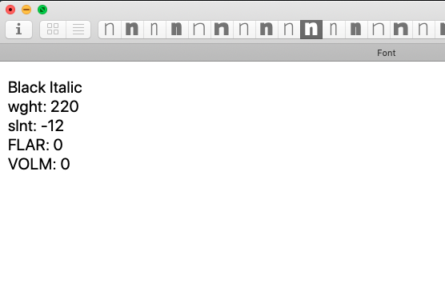

# ShowMasterName
Glyphs App plugin for display current master axes coordinates in the edit view.

The plugin will show in the top left corner of the Edit view a text with the master name and the axes locations. It can be useful to know "where you are" in projects with large number of masters.

## How to use:

Open a fonts and activate the plugin via View>Show Master Name menu item.

## Installation:

For better update handling install the plugin via the Window > Plugin Manager inside Glyphs App and restart the app.
